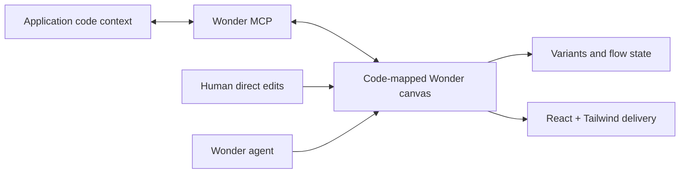

# Wonder

Wonder's definition of design is a **code-mapped document** — a canvas whose representation is claimed to map one-to-one to application code, so that "design" and "implementation" are not separate artifacts but two faces of the same structure. Its ordinary job is to generate and then directly edit UI on that canvas and move changes in either direction between the design and a coding agent.

## The canvas and the code agent share one boundary

Wonder's [MCP server](https://wonder.design/docs/mcp) can read *and* write Wonder design data. A coding agent can pull an existing component's context into the canvas, and the canvas can push intent back out toward code-side changes. The canvas itself supports precise selection edits, style variants and continuing flows, with React and Tailwind as the delivery format ([product](https://wonder.design/)).

## "One-to-one" is a product contract, not an observed parser

First-party docs establish direct data access and bidirectional tools, but they do not publish the design schema or the mapping implementation. So the record holds "one-to-one" as a source-authority/live-projection contract at the observable boundary, without claiming lossless equivalence for arbitrary React components or round-trip preservation of application logic. Wonder continues the founding team's earlier Superflex design-to-code product, but the lineage moved from export-oriented translation toward this continuing code-and-canvas document — the authority itself changed shape.

Public alpha material ([Wonder](https://wonder.design/) · [Wonder MCP documentation](https://wonder.design/docs/mcp) · [public-alpha lineage account](https://www.producthunt.com/products/wonder-public-alpha)) does not establish file serialization, autosave guarantees, named versions, branch/merge behavior, MCP authorization, or conflict semantics. Production compatibility with a given codebase remains an acceptance question.
