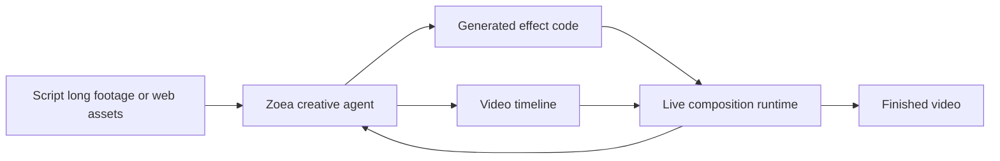

# Zoea

Zoea defines design as **authoring effects as code inside a live video project**. Rather than exposing a fixed menu of opaque generative operations, its desktop app pairs chat/script context with a preview timeline and a code editor, so the requested captions, transitions, motion graphics or compositing are *written* as effect code and judged in the same live preview as manually assembled media.

## A code-and-runtime loop, not a generator menu

The [desktop surface](https://zoea.io/) combines chat and Markdown context with a timeline. An agent identifies moments in long recordings, imports web media, and writes the implementation for a requested effect ([script-to-video workflow](https://zoea.io/docs/script-to-video-workflow)). Because effects are rendered through a live composition runtime ([motion graphics as code](https://zoea.io/docs/motion-graphics-as-code)), the same judged preview serves both generated and hand-built layers — the agent's output is not a one-shot bake but an editable piece of the composition.

This loop is what separates Zoea from editors that reveal only opaque generative buttons: the generated artifact is code, so it can be re-run, edited and composed. Public material does not disclose the project file format, execution sandbox, supported effect APIs, save/version implementation, or export interchange; macOS and Windows availability establishes a current user surface ([zoea.io](https://zoea.io/)) but not source openness.
