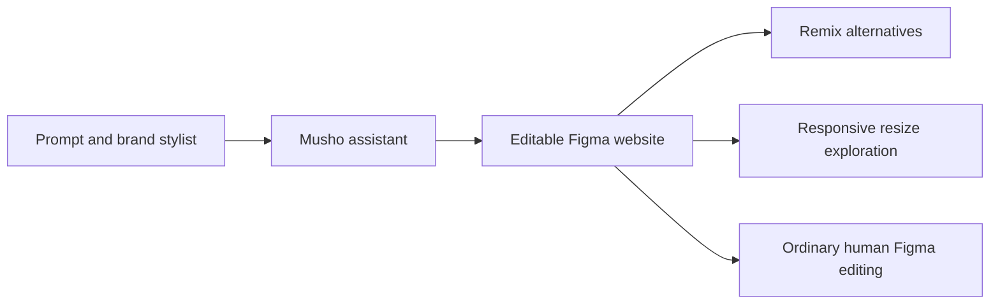

# Musho

> Research status: **Architecture-level historical record** · Last reviewed: **2026-08-11**

| Field | Value |
|---|---|
| Team | Musho · team region not established |
| Ordinary job | turn a short prompt into an on-brand editable website design inside Figma |
| Authority | the generated native Figma design |
| Lifecycle | historical; former domain parked |

## Generation stayed inside the host canvas

The maker's launch described a Figma assistant that generated website layouts copy and imagery from a prompt. “Stylists” carried brand direction. Remix produced alternate directions and drag-to-resize explored responsive layouts. The output was intended as developer-ready editable Figma work rather than a downloaded image.

## Identity and lifecycle correction

The discovery register originally used “Mushu” and `mushu.ai`. The documented product was **Musho** at `musho.ai`. Its 2024 Product Hunt launch contains a direct maker account of the operating product. On 2026-08-11 the former domain was a sale page so this dossier preserves a historical design definition rather than presenting a current tool.

## Evidence ceiling

No current first-party documentation source repository plugin package or persistence contract remains available. The surviving maker description establishes the visible workflow but cannot establish the internal model native-node strategy final shipped limits or shutdown date.

## Primary evidence

- [Contemporaneous maker launch](https://www.producthunt.com/products/musho)
- [Former product domain now parked](https://musho.ai/)
