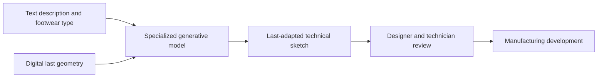

# INESCOP footwear prototype

> Research status: **Architecture-level historical research record** · Last reviewed: **2026-08-12**

| Field | Value |
|---|---|
| Team | INESCOP and ITI · Spain |
| Project | AIGEN4FASHION |
| Ordinary job | turn a footwear description into a technical sketch already adapted to the target digital last |
| Engineering authority | digital last geometry and manufacturing review |
| Lifecycle | funded project completed 2026-05-31; no public production release established |

## Geometry enters before the concept is promoted

The prototype specializes a generative model for footwear. A user describes a model and the system generates a technical sketch constrained by a selected digital last. The last is not a style reference: it encodes the foot-shaped volume around which a shoe must be designed. The intended output can therefore enter a manufacturing conversation rather than remain free-form concept art.

## A prototype is not a purchasable CAD system

INESCOP and ITI describe an R&D prototype and a funded development period not a public self-serve product. It is retained because it demonstrates a distinct technical definition: generative design is constrained by an industrial geometric authority before human promotion. The lifecycle is historical until a later operating product or deployment is evidenced.

## Evidence ceiling

Public pages do not expose model architecture training corpus interface sketch file format last representation dimensional validation or downstream CAD integration. “Ready to manufacture” is treated as the project's intended handoff state and still requires professional review.

## Primary evidence

- [INESCOP prototype announcement](https://www.inescop.es/es/actualidad/noticias/940-inescop-desarrolla-un-prototipo-de-ia-generativa-que-convierte-descripciones-en-bocetos-de-calzado)
- [Official AIGEN4FASHION project boundary and dates](https://www.inescop.es/es/i-d-i/proyectos-i-d-i/proyectos-i-d-i-ivace/ivace/63-2025/867-aigen4fashion)
- [Project technical leaflet](https://www.inescop.es/images/Proyectos/Regionales/2025/AIGEN4FASHION/Folleto_AIGEN4FASHION.pdf)
