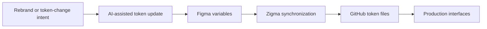

# Zigma

> Research status: **Architecture-level historical record** · Last reviewed: **2026-08-11**

| Field | Value |
|---|---|
| Team | Zigma by NextUI · team region not established |
| Ordinary job | change a design system through tokens and carry Figma variables into production code |
| Authority boundary | Figma variable collections upstream and repository token files downstream |
| Lifecycle | historical; the former product domain is parked |

## A narrow artifact can still define Design

Zigma did not claim to author an entire canvas. Its unit of control was the design token: color typography and other reusable decisions shared across products. The launch described AI-assisted token updates followed by synchronization from Figma into GitHub projects. This places the agent at the system-governance layer where one decision can update many interfaces.

## Historical cutoff

The contemporaneous launch account from the maker establishes the product identity and claimed mechanism. On 2026-08-11 `zigma.io` redirected to a domain-sale page and no current application or documentation surface could be established. Zigma is therefore retained as a historical technical definition rather than reported as an active option.

The evidence supports Figma-to-code token materialization. It does not support claiming a general bidirectional canvas-code round trip or that later planned components layouts documentation and Storybook integration shipped.

## Evidence ceiling

No source repository schema API synchronization protocol conflict behavior or version model was located. The implementation cannot be pinned and the surviving evidence cannot establish production adoption or final product state.

## Primary evidence

- [Contemporaneous maker launch](https://www.producthunt.com/posts/zigma-by-nextui-yc-s24)
- [Contemporaneous launch account and demo summary](https://www.fondo.com/blog/zigma-launches)
- [Former product domain now parked](https://zigma.io/)
