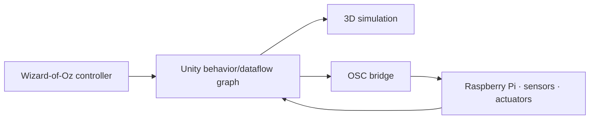

# Delft AI Toolkit

> Research status: **Source-level** · Lifecycle: **historical** · Last reviewed: **2026-08-12**

Delft AI Toolkit is a visual authoring environment for prototyping the behavior of smart physical things. It joins a Unity node graph simulated hardware Wizard-of-Oz control and a Raspberry Pi robot so designers can test an interaction before committing to the final sensing and ML implementation.

## Simulation and embodiment share one behavior graph

At commit [`9302641`](https://github.com/pvanallen/delft-toolkit-v2/tree/9302641395b7c29a2f3757949c7b6571ee57ec0e) xNode-backed Unity assets connect actions conditions data flow loops and state. Nodes can invoke speech services object recognition motors servos LEDs and sensors. The same graph can operate a 3D simulated device or communicate over OSC with the Raspberry Pi hardware.

User-trained Teachable Machine models and TensorFlow Lite recognition can enter the graph without giving ML control over sequencing. Graph assets are the behavioral authority; simulated and physical runs are two projections.

The earlier `delft-toolkit-prototype` repository explicitly points to this version and is counted as a predecessor in the same lineage. Documentation dates its last public release to 2021 so lifecycle is historical. The maintainer profile identifies Delft Netherlands.

## Evidence

- [Graph control documentation](https://github.com/pvanallen/delft-toolkit-v2/blob/9302641395b7c29a2f3757949c7b6571ee57ec0e/docs/graph-control.md)
- [State graph editor](https://github.com/pvanallen/delft-toolkit-v2/blob/9302641395b7c29a2f3757949c7b6571ee57ec0e/unity/delft-toolkit/Assets/Scripts/delftToolkit/Editor/StateGraphEditor.cs)
- [Pinned README](https://github.com/pvanallen/delft-toolkit-v2/blob/9302641395b7c29a2f3757949c7b6571ee57ec0e/README.md)
